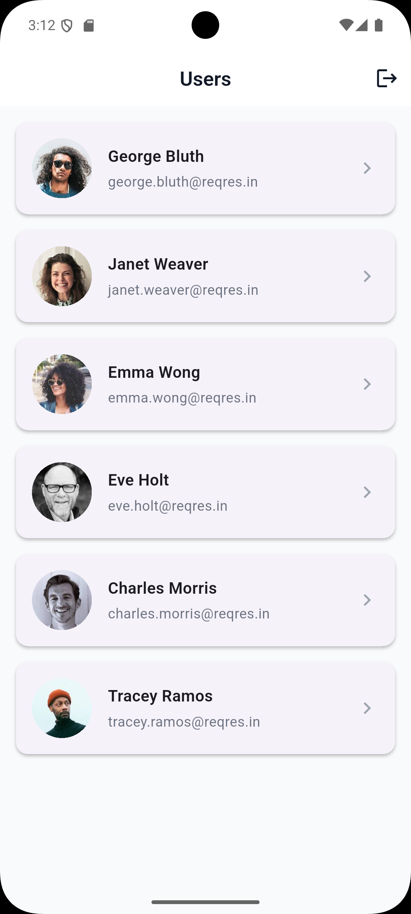
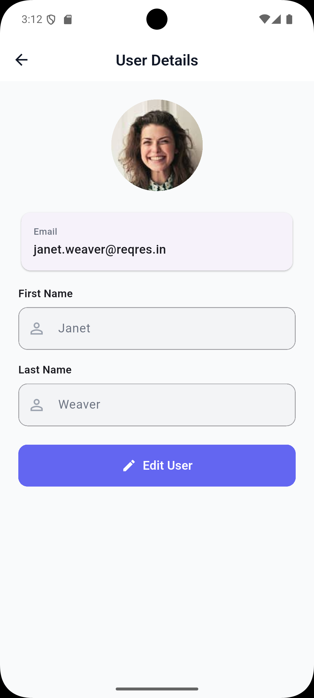
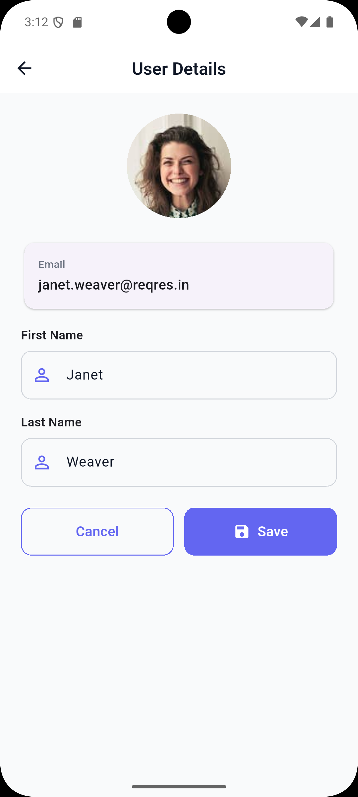

# 🧑‍🤝‍🧑 User Management App

[](https://flutter.dev/)
[](https://dart.dev/)
[](https://bloclibrary.dev/)
[](https://blog.cleancoder.com/uncle-bob/2012/08/13/the-clean-architecture.html)

A professional, feature-rich Flutter application demonstrating **Clean Architecture**, **MVVM**, and advanced state management with **BLoC/Cubit**.

## 📱 Visual Showcase

<p align="center">
  
  
  
  
</p>

## 📱 Features

- **Authentication**
  - Email and password login
  - Form validation
  - Secure token storage
  - Auto-login on app restart

- **User Management**
  - View paginated user list
  - Pull-to-refresh functionality
  - Infinite scroll pagination
  - View detailed user information
  - Edit user details

- **Error Handling**
  - Network error handling
  - User-friendly error messages
  - Retry mechanisms

## 🏗️ Architecture

The app follows **Clean Architecture** with a feature-driven structure, ensuring high maintainability and scalability:

```
lib/
├── core/
│   ├── network/      # API client, network info & dartz integration
│   ├── di/           # GetIt service locator setup
│   ├── constants/    # Theme, colors, and strings
│   ├── utils/        # App navigators and common helpers
│   └── widgets/      # Shared UI components
├── features/
│   ├── auth/         # Login, logout, and session management
│   ├── users_list/   # Paginated list of users
│   └── user_detail/  # Detailed view & editing for users
└── main.dart         # Entry point and state-driven root navigation
```

## 🛠️ Technology Stack

- **Framework**: [Flutter](https://flutter.dev/) (v3.2.0+)
- **State Management**: [BLoC / Cubit](https://pub.dev/packages/flutter_bloc)
- **Functional Programming**: [Dartz](https://pub.dev/packages/dartz) (Either pattern for error handling)
- **Networking**: [Dio](https://pub.dev/packages/dio) & [Internet Connection Checker Plus](https://pub.dev/packages/internet_connection_checker_plus)
- **Dependency Injection**: [GetIt](https://pub.dev/packages/get_it)
- **Local Storage**: [Shared Preferences](https://pub.dev/packages/shared_preferences)
- **Image Handling**: [Cached Network Image](https://pub.dev/packages/cached_network_image)

## 🔑 Key implementation Details

### 🧩 Functional Error Handling
We use the **Either** pattern from the `dartz` package. This forces explicit handling of failure states (`Left`) and success states (`Right`) at the repository level, resulting in more robust and predictable UI logic.

### 🛣️ State-Driven Navigation
Navigation to/from authentication screens is handled automatically in `main.dart` via `BlocBuilder`. By observing the `AuthCubit` state, the app roots itself into either the `LoginScreen` or `UsersListScreen`, ensuring a seamless and secure user experience.

### 📜 Clean Repository Pattern
Each feature contains its own Domain, Data, and Presentation layers. Repositories are defined as abstract interfaces in the domain layer and implemented in the data layer, facilitating easy testing and decoupling.

### 🚀 Performance & UI/UX
- **Infinite Scrolling**: Implemented in `UsersListScreen` using `ScrollController` and BLoC.
- **Micro-Animations**: Uses Flutter's built-in animation system and `Hero` widgets (where applicable).
- **Responsive Layouts**: Designed to look premium across various screen sizes.

## 📝 API Endpoints Used

**Base URL**: `https://reqres.in/api`

| Endpoint | Method | Description |
|----------|--------|-------------|
| `/login` | POST | User authentication |
| `/users?page={p}` | GET | Paginated users list |
| `/users/{id}` | GET | Single user details |
| `/users/{id}` | PUT | Update user profile |

## 🚀 Getting Started

1. **Clone the repo**: `git clone <repo-url>`
2. **Setup**: `flutter pub get`
3. **Launch**: `flutter run`

## 🔐 Test Environment

Use these demo credentials provided by the ReqRes API:
- **Email**: `eve.holt@reqres.in`
- **Password**: `cityslicka`

---
**Built with ❤️ by Mahmoud Hamza**
